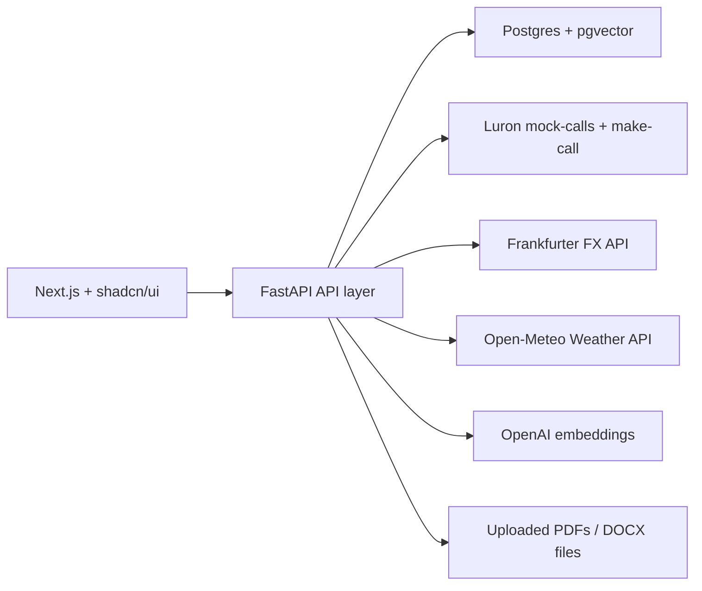
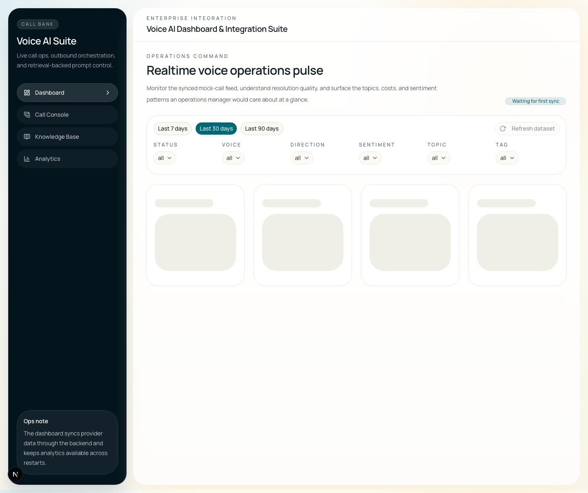
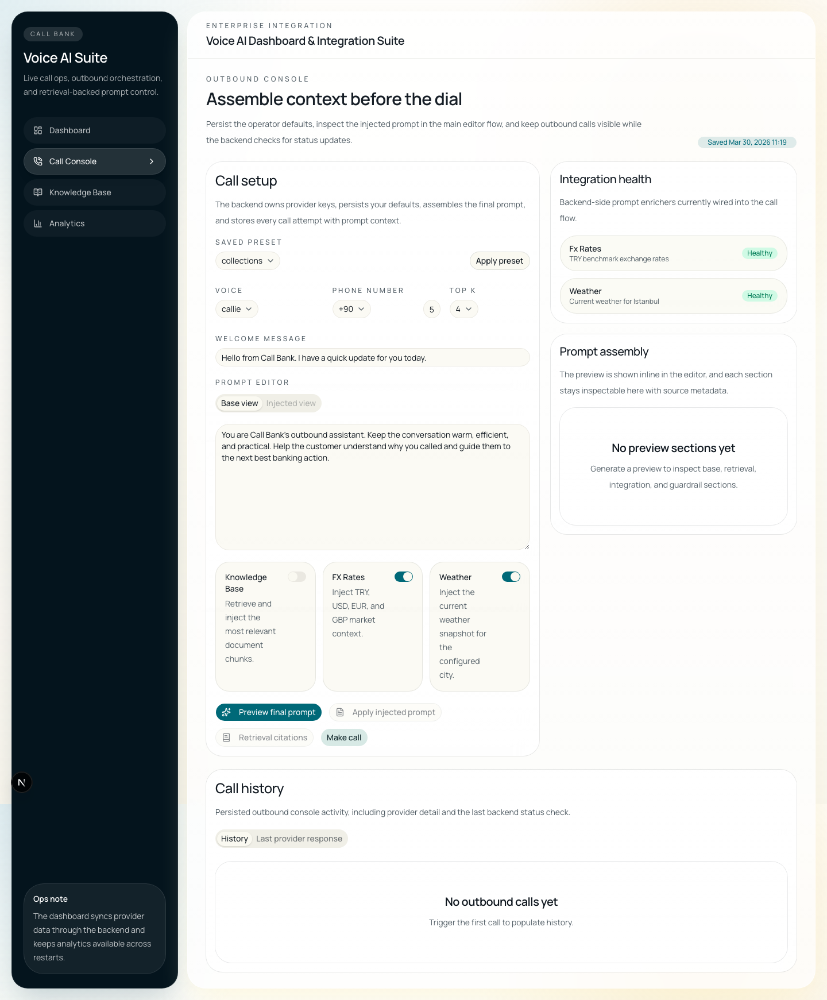
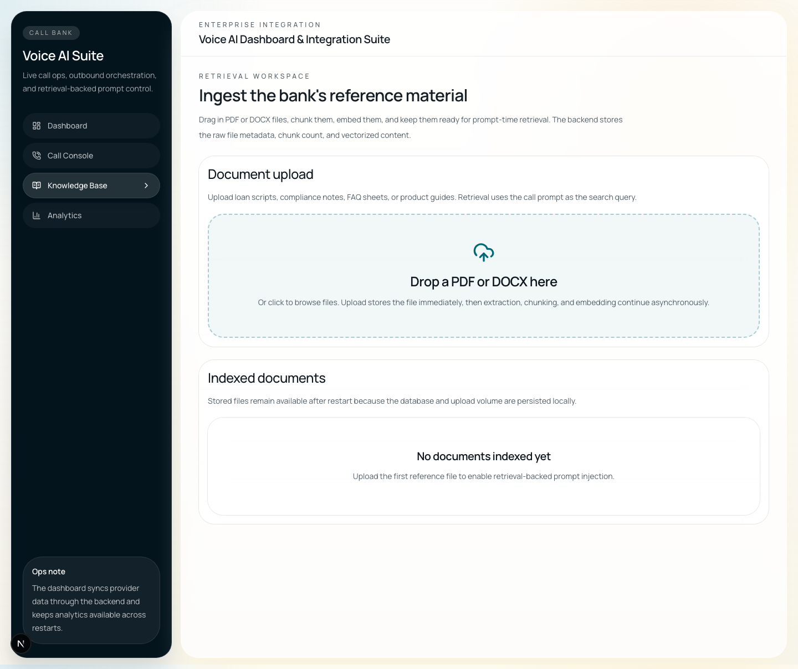
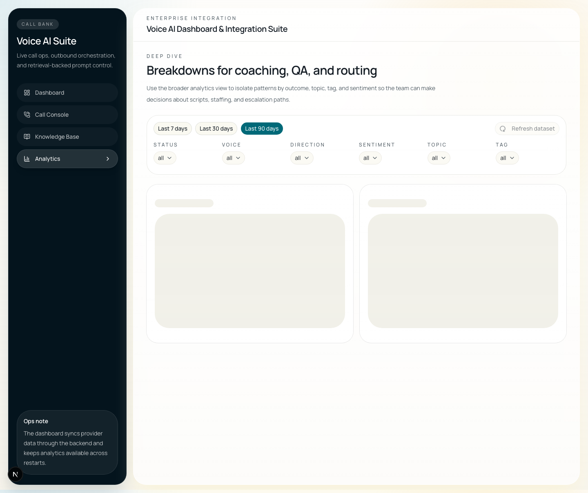

# Call Bank Voice AI Suite

Full-stack Voice AI dashboard and integration suite for the Luron AI case study. The project includes:

- A `Next.js` + `shadcn/ui` operations dashboard
- A `FastAPI` backend that proxies Luron calls and syncs analytics data
- `Postgres + pgvector` for persisted app data and retrieval chunks
- A drag-and-drop knowledge base with PDF/DOCX ingestion
- Prompt enrichment from live FX and weather APIs

## Architecture

## Repo Layout

- `apps/web`: App Router frontend, charts, filters, call console, knowledge base UI
- `apps/api`: FastAPI service, Alembic migration, SQLAlchemy models, analytics/prompt/integration services
- `docker-compose.yml`: one-command local startup for web, API, and Postgres
- `.env.example`: environment template

## Setup

1. Copy `.env.example` to `.env`.
2. Set `LURON_API_KEY`. Add `OPENAI_API_KEY` if you want OpenAI embeddings instead of the deterministic local fallback.
3. If your provider exposes a manual-call status endpoint, set `LURON_CALL_STATUS_URL_TEMPLATE` with a URL that contains `{call_id}`.
4. Run `docker compose up --build`.
5. Open [http://localhost:3000](http://localhost:3000).

### Clean-clone smoke path

1. `cp .env.example .env`
2. Fill `LURON_API_KEY`
3. Optionally fill `OPENAI_API_KEY`
4. Optionally set `LURON_CALL_STATUS_URL_TEMPLATE=https://provider.example.com/calls/{call_id}`
5. `docker compose up --build`
6. Visit [http://localhost:3000](http://localhost:3000) and [http://localhost:8000/api/ready](http://localhost:8000/api/ready)

### Local non-Docker workflow

- Frontend: `cd apps/web && pnpm install && pnpm dev`
- Backend: `cd apps/api && uv sync --extra dev && uv run alembic upgrade head && uv run uvicorn app.main:app --reload`

## Environment Variables

| Variable | Required | Purpose |
| --- | --- | --- |
| `NEXT_PUBLIC_API_BASE_URL` | no | Browser URL for the backend API |
| `DATABASE_URL` | yes | SQLAlchemy/Postgres connection string |
| `LURON_BASE_URL` | no | Luron API base URL |
| `LURON_API_KEY` | yes | Backend-only key for mock call sync and outbound calls |
| `LURON_CALL_STATUS_URL_TEMPLATE` | no | Optional provider status lookup URL, for example `https://provider.example.com/calls/{call_id}` |
| `OPENAI_API_KEY` | no | Embedding provider key |
| `OPENAI_EMBEDDING_MODEL` | no | Embedding model name |
| `FX_API_URL` | no | FX provider endpoint |
| `WEATHER_API_URL` | no | Weather provider endpoint |
| `WEATHER_GEOCODE_API_URL` | no | Geocoding endpoint for city lookup |
| `DEFAULT_WEATHER_CITY` | no | Default city for weather prompt injection |
| `DEFAULT_WEATHER_LAT` | no | Default city latitude |
| `DEFAULT_WEATHER_LON` | no | Default city longitude |
| `CORS_ORIGINS` | no | Allowed frontend origins |

## Module Walkthrough

### Dashboard

- Syncs mock call data through the backend and persists it in Postgres
- Shows KPI cards, call volume trend, status stack, sentiment split, topics, scatter analysis, and recent calls
- Supports day-range and categorical filtering with backend-backed refresh

### Call Console

- Chooses between `callie` and `burcin`
- Persists last-used console defaults in the backend and restores them after restart
- Assembles a prompt with optional knowledge-base, FX, and weather sections
- Shows the injected prompt inline in the main editor flow before making the backend-proxied Luron call
- Persists outbound attempts and prompt-context audit data
- Polls manual calls through a backend refresh endpoint until the call reaches a terminal state or the provider reports that live refresh is unsupported

### Knowledge Base

- Accepts `.pdf` and `.docx`
- Stores the file immediately, then runs extraction, chunking, and embedding in the background
- Keeps staged processing status, timestamps, uploaded metadata, and chunk counts visible in the UI

### Analytics

- Provides additional tag and outcome breakouts for QA and routing review
- Adds a sentiment-by-topic view to surface topics that trend positive or negative faster
- Adds a 7x24 activity heatmap so busy windows are visible by weekday and hour

## Usage Flow

1. Open the dashboard to sync and inspect the latest mock call feed.
2. Go to the Call Console and set the voice, phone number, prompt, and enrichment toggles.
3. Preview the final prompt. The injected result appears directly in the editor area, and citations can be opened from the side drawer.
4. Trigger a call. The request is proxied through the backend, persisted locally, and shown in call history with status detail and last-checked time.
5. Upload PDF or DOCX files in Knowledge Base. The file is stored immediately, then the list updates through staged `uploaded`, `extracting`, `chunking`, `embedding`, and `indexed` states.
6. Return to the Call Console and enable Knowledge Base injection to reuse indexed material in later prompts.

## API Surface

- `GET /api/dashboard/summary`
- `GET /api/dashboard/timeseries`
- `GET /api/calls`
- `GET /api/calls/{id}`
- `POST /api/calls/{id}/refresh-status`
- `POST /api/calls`
- `POST /api/prompts/preview`
- `GET /api/knowledge/documents`
- `POST /api/knowledge/documents`
- `DELETE /api/knowledge/documents/{id}`
- `GET /api/integrations/status`
- `GET /api/settings/call-console`
- `PUT /api/settings/call-console`
- `GET /api/health`
- `GET /api/ready`

## Verification

- Frontend build: `cd apps/web && pnpm build`
- Frontend lint: `cd apps/web && pnpm lint`
- Backend tests: `cd apps/api && uv run pytest`
- Backend import smoke test: `cd apps/api && uv run python -c "from app.main import app; print(app.title)"`
- Stack health: `docker compose up -d --build`

## Screenshots

### Dashboard

### Call Console

### Knowledge Base

### Analytics

## Notes

- Manual-call status refresh is configurable. If `LURON_CALL_STATUS_URL_TEMPLATE` is unset, the backend marks refresh as unavailable instead of implying that live status exists.
